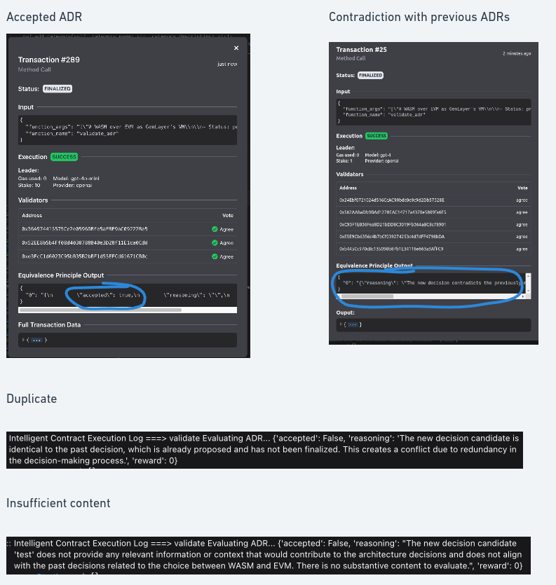

# ADRValidator
## Overview
The ADRValidator GenLayer contract is a comprehensive tool designed for the automated validation, management, and enforcement of architecture decision records (ADRs) within a decentralized framework. It is built on the GenLayer infrastructure, which supports trustless operations and ensures a high standard of consistency and reliability across various architectural decisions. This tool is invaluable in environments where decisions impact shared resources, including software architecture or budget allocations.

## Output Examples
Below are explanations of various outputs from the ADRValidator, which illustrate how the system responds to different scenarios in the validation process:

## Key Features

### Owner Management

- **Ownership Control:** Secure methods to transfer ownership of the contract ensuring that administrative privileges are safeguarded.

### ADR Validation Mechanisms

- **Comprehensive Validation Checks:** Multiple asynchronous checks validate the logical structure, decision-making clarity, relevance of problem statements, and decision drivers. You can read more [here](./validation_checks.md).

### Reward System

- **Token-based Incentives:** Implements a reward system that allocates tokens based on the ADR's impact, importance, and quality, encouraging high-quality contributions.

## Usage
### When to Use
**Resource Decision Making:** Ideal for decisions involving shared resources, be it tangible assets like budget allocations or intangible ones like software design principles.

### Benefits
**Automated Decision-Making:** Reduces the workload on individuals by automating the validation process.
**Trustless Operation:** Minimizes the risk of biased decisions by removing personal discretion from the validation process.

## Market Potential and Future Directions

### Applicability

- **Wide Applicability:** Ideal for any development team or organization using ADRs to guide architectural decisions. Its flexibility makes it a robust tool across different industries.

### Future Enhancements

- **Integration with Development Platforms:** Future versions will aim to integrate directly with platforms like GitHub, creating a seamless experience for managing ADRs.
- **Spam and Fraud Mitigation:** Enhancements to improve robustness against low-quality or fraudulent submissions.
