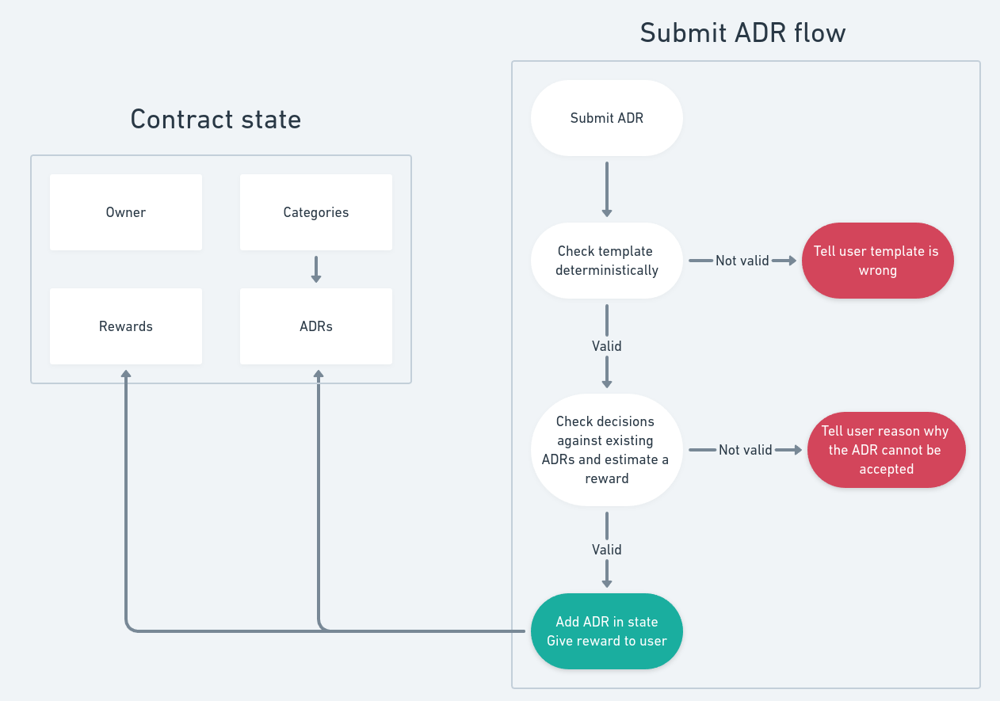

# ADRValidator
## Overview
The ADRValidator is a tool designed to facilitate automated and trustless decision-making for architectural decision records (ADRs). It leverages the GenLayer infrastructure to validate, categorize, and ensure the consistency of ADRs across different projects. This system is particularly useful in contexts where decisions about shared resources, including money or software architecture, are critical.

## Output Examples
Below are explanations of various outputs from the ADRValidator, which illustrate how the system responds to different scenarios in the validation process:

## Features
### Template Validation
**Regex-based Format Checking:** Ensures all ADRs adhere to a specific template format using regular expressions.

### Categorization
**Dynamic Category Management:** Allows the owner to define and manage different architectural categories.

### Consistency Checking
**Contradiction Analysis:** Compares new ADRs against existing ones to detect contradictions, ensuring alignment with established principles.

### Reward System
**Token-based Incentives:** Rewards contributions based on the impact, importance, and quality of writing. This system encourages meaningful contributions and could potentially be used to determine winners in competitions like hackathons.

## Usage
### When to Use
**Resource Decision Making:** Ideal for decisions involving shared resources, be it tangible assets like budget allocations or intangible ones like software design principles.

### Benefits
**Automated Decision-Making:** Reduces the workload on individuals by automating the validation process.
**Trustless Operation:** Minimizes the risk of biased decisions by removing personal discretion from the validation process.

## Market Potential
ADRValidator is not limited to GenLayer's internal use but can be integrated by any development team that utilizes ADRs to govern architecture decisions. Its universal applicability makes it a valuable tool for a wide range of software development projects.

## Future Challenges
Future enhancements will focus on robustness to prevent spammy or fake ADR submissions. Additionally, the goal is to integrate this system directly with platforms like GitHub, turning it into a comprehensive repository for ADRs accessible to developers worldwide.